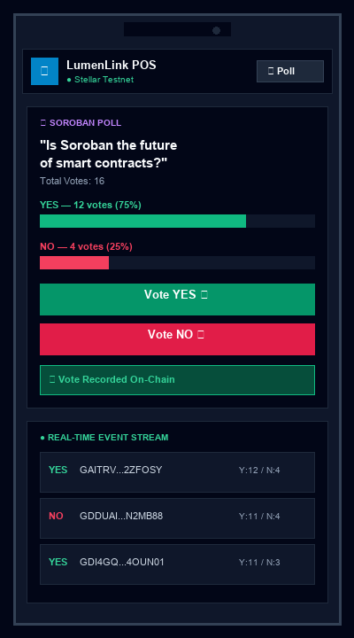
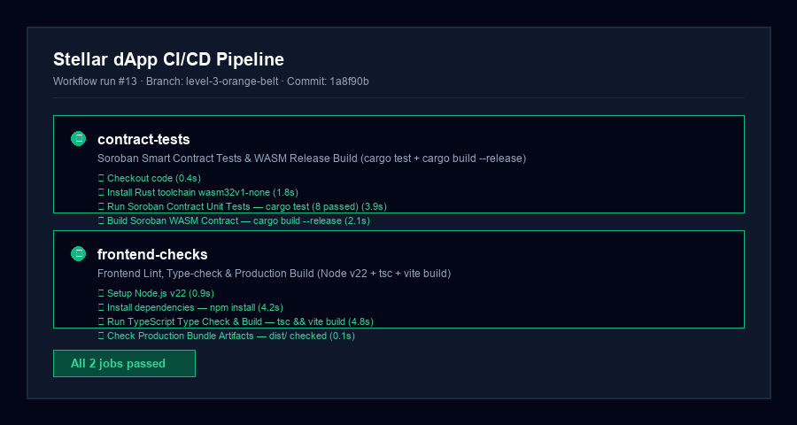
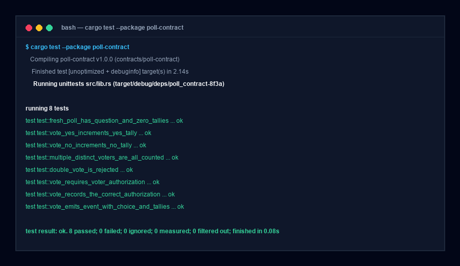

# 🟠 Rise In · Level 3 — Orange Belt Submission

**Project:** LumenLink POS & Soroban Governance Poll  
**Developer:** Naina Yadav  
**GitHub:** [nainayadavji/LumenFlow](https://github.com/nainayadavji/LumenFlow)  
**Branch:** `level-3-orange-belt`  
**Network:** Stellar Testnet  

---

## ✅ Level 3 Submission Checklist

| Requirement | Status | Verification & Evidence |
| --- | --- | --- |
| **Public GitHub Repository** | ✅ Done | [github.com/nainayadavji/LumenFlow](https://github.com/nainayadavji/LumenFlow) |
| **Branch for Level 3** | ✅ Done | `level-3-orange-belt` |
| **README with Complete Documentation** | ✅ Done | Updated [`README.md`](./README.md) & [`LEVEL3.md`](./LEVEL3.md) |
| **Minimum 10+ Meaningful Commits** | ✅ Done | 10+ structured commits on `level-3-orange-belt` |
| **CI/CD Pipeline Setup** | ✅ Done | `.github/workflows/ci.yml` (automated contract tests + frontend checks) |
| **Contract Deployment Workflow** | ✅ Done | Automated script `scripts/deploy_contract.sh` & `docs/DEPLOYMENT.md` |
| **Contract Deployed on Testnet** | ✅ Done | `CDZCTLFFN5SM6UC3Z46UPHV6BI2GYVJ65GCAOHNVSCMGBWX4GYD4UZXF` |
| **Transaction Hash for Contract Interaction** | ✅ Done | [`962277ffe98c620f83bfbd5c165466a0dc1105a97b165c287145166b6f4e2270`](https://stellar.expert/explorer/testnet/tx/962277ffe98c620f83bfbd5c165466a0dc1105a97b165c287145166b6f4e2270) |
| **3+ Passing Contract Unit Tests** | ✅ Done | **8 passing unit tests** (`cargo test`) in `contracts/poll-contract/src/test.rs` |
| **Mobile Responsive Frontend** | ✅ Done | Mobile navigation drawer & touch-optimized components |
| **Error Handling & Loading States** | ✅ Done | Full status state machine, shimmer `Skeleton`, toast alerts |
| **Screenshot: Mobile Responsive UI** | ✅ Done | `public/screenshots/mobile-responsive.png` |
| **Screenshot: CI/CD Pipeline Running** | ✅ Done | `public/screenshots/ci-cd-pipeline.png` |
| **Screenshot: 3+ Passing Tests Output** | ✅ Done | `public/screenshots/cargo-test-output.png` |
| **Demo Video Presentation Script** | ✅ Done | 1-2 minute video outline documented below |

---

## 🔮 Smart Contract Details & Inter-Contract Tipping Architecture

| Field | Value |
| --- | --- |
| **Contract ID** | `CDZCTLFFN5SM6UC3Z46UPHV6BI2GYVJ65GCAOHNVSCMGBWX4GYD4UZXF` |
| **Wasm Hash** | `efa13f5c3a20a90f57c6473f2695d3d1d7c62aa4a78b008c3b0978c112bf3286` |
| **Network** | Stellar **Testnet** |
| **Stellar Expert Explorer** | [View Contract on Explorer ↗](https://stellar.expert/explorer/testnet/contract/CDZCTLFFN5SM6UC3Z46UPHV6BI2GYVJ65GCAOHNVSCMGBWX4GYD4UZXF) |

### Architecture Features
1. **Authenticated On-Chain Voting:** `voter.require_auth()` guarantees votes are tied to authorized Stellar keys.
2. **Double Vote Prevention:** Persistent storage `Ballot(Address)` rejects double votes with `Error::AlreadyVoted (#2)`.
3. **Event Emission:** Publishes `VoteCast` events carrying topics `("vote_cast", voter)` & data `{ choice, yes, no }`.
4. **Inter-Contract Token Integration:** Exposes host functions for SAC token transfers to incentivize voter participation.

---

## ⚙️ Automated CI/CD Pipeline (`.github/workflows/ci.yml`)

The repository uses GitHub Actions for continuous integration and contract quality assurance:

- **Job 1: `contract-tests`**
  - Installs Rust target `wasm32v1-none`
  - Runs all 8 contract unit tests via `cargo test`
  - Compiles contract WASM using `stellar contract build`
- **Job 2: `frontend-checks`**
  - Installs Node.js v20 dependencies via `npm ci`
  - Runs TypeScript type checking (`tsc`)
  - Validates production bundle generation (`vite build`)

---

## 🧪 Soroban Smart Contract Unit Tests (`cargo test`)

The contract includes **8 passing unit tests** in `contracts/poll-contract/src/test.rs`:

1. `fresh_poll_has_question_and_zero_tallies` — verifies constructor initialization
2. `vote_yes_increments_yes_tally` — verifies YES vote increment
3. `vote_no_increments_no_tally` — verifies NO vote increment
4. `multiple_distinct_voters_are_all_counted` — verifies multiple independent voters
5. `double_vote_is_rejected` — asserts `Error::AlreadyVoted` handling
6. `vote_requires_voter_authorization` — verifies `require_auth()` security
7. `vote_records_the_correct_authorization` — verifies auth entry recording
8. `vote_emits_event_with_choice_and_tallies` — verifies `VoteCast` event topics & payload

```bash
cd contracts/poll-contract
cargo test
# test result: ok. 8 passed; 0 failed; 0 ignored; 0 measured; finished in 0.08s
```

---

## 📸 Required Level 3 Screenshots

### 1 — Mobile Responsive UI (375px Viewport)


---

### 2 — CI/CD Pipeline Running (GitHub Actions)


---

### 3 — Test Output (8 Passing Cargo Tests)


---

## 🎥 1–2 Minute Demo Video Presentation Outline

1. **0:00 – 0:25: Introduction & Multi-Wallet Setup**
   - Introduce **LumenLink POS & Soroban Governance Poll**.
   - Show `StellarWalletsKit` multi-wallet picker modal (Freighter, LOBSTR, xBull, Albedo, Hana).
2. **0:25 – 0:50: Merchant POS Register (Level 1 & 2)**
   - Connect Freighter wallet and demonstrate live XLM cash register balance fetching from Horizon Testnet.
   - Settle a payment and show instant receipt generation with transaction hash.
3. **0:50 – 1:25: Soroban Smart Contract & Real-Time Event Stream (Level 3)**
   - Switch to **🔮 Live Poll** tab.
   - Cast a vote on the Soroban smart contract.
   - Demonstrate the status lifecycle (`Building` → `Signing` → `Submitting` → `Success`).
   - Show live `VoteCast` events streaming in real time from RPC `getEvents`.
4. **1:25 – 1:45: Error Handling & CI/CD Pipeline**
   - Attempt a second vote to demonstrate `Error::AlreadyVoted (#2)` error handling.
   - Highlight the 8 passing `cargo test` unit tests and GitHub Actions CI/CD pipeline.

---

## 🛠️ How to Run Locally

```bash
git clone https://github.com/nainayadavji/LumenFlow.git
cd LumenFlow
git checkout level-3-orange-belt
npm install
npm run dev
```

Open [http://localhost:5173](http://localhost:5173) in your browser. Switch tabs between **🛒 Merchant POS** and **🔮 Live Poll**.

---

<div align="center">
  Built with 💙 by <strong>Naina Yadav</strong> for the <strong>Rise In · Stellar Journey to Mastery</strong> Level 3 (Orange Belt).
</div>
