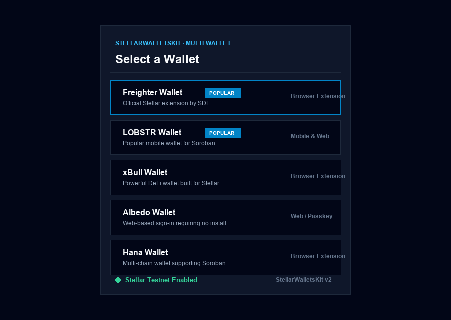
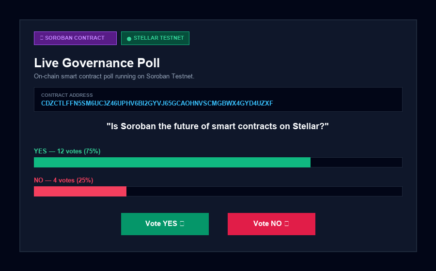
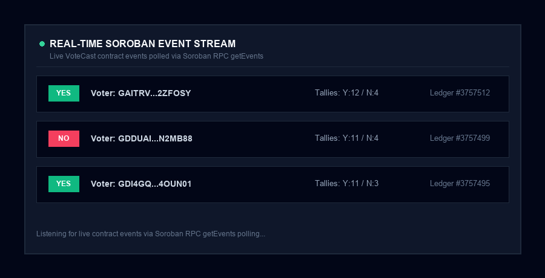

# 🛒 LumenLink POS & Soroban Live Poll

> **Rise In · Stellar Journey to Mastery — Full Submission (Level 1 White Belt & Level 2 Yellow Belt)**

A clean, premium **Web3 Point-of-Sale Register & Soroban Governance Poll dApp** built on the **Stellar Testnet**.
Features **StellarWalletsKit multi-wallet connection**, real-time **Horizon XLM payment settlements**, and an **on-chain Soroban smart contract poll** with real-time event streaming via Soroban RPC. Built with **React 18 + Vite 5 + TypeScript + Tailwind CSS**, **Soroban SDK (Rust)**, and `@stellar/stellar-sdk`.

- 🔗 **GitHub Repository:** [github.com/nainayadavji/LumenFlow](https://github.com/nainayadavji/LumenFlow)
- 🔮 **Deployed Soroban Contract ID:** `CDZCTLFFN5SM6UC3Z46UPHV6BI2GYVJ65GCAOHNVSCMGBWX4GYD4UZXF`
- ⚡ **Sample Vote Tx Hash:** [`962277ffe98c620f83bfbd5c165466a0dc1105a97b165c287145166b6f4e2270`](https://stellar.expert/explorer/testnet/tx/962277ffe98c620f83bfbd5c165466a0dc1105a97b165c287145166b6f4e2270)
- 🥋 **Level 1 Readme:** [`LEVEL1.md`](./LEVEL1.md) | 🟡 **Level 2 Readme:** [`LEVEL2.md`](./LEVEL2.md)


---

## 🏆 Level-by-Level Submission Summaries

### 🥋 Level 1 — White Belt (Completed)

Focus: Wallet setup, XLM balances, and Testnet transaction settlements.

| Requirement | Status | Verification & Code Evidence |
| --- | --- | --- |
| **Detect Stellar Wallet Integration** | ✅ Done | `import { isConnected, isAllowed, requestAccess, getAddress, signTransaction } from '@stellar/freighter-api'` in `src/services/freighter.ts` |
| **Verify Connect Wallet Functionality** | ✅ Done | `WalletConnect` component in `src/components/wallet/WalletConnect.tsx` calling `connectWallet()` |
| **Wallet Permissions & Address Retrieval** | ✅ Done | `requestAccess()` and `getAddress()` implemented in `src/services/freighter.ts` |
| **Transaction Signing** | ✅ Done | `signTransaction(xdr, { networkPassphrase })` implemented in `src/services/freighter.ts` & `src/context/WalletContext.tsx` |
| **Fetch & Display XLM Balance** | ✅ Done | Native XLM balance fetched via Horizon API (`loadAccount`) |
| **Send XLM Payment Transaction** | ✅ Done | Payment transaction built, signed by Freighter, and submitted |
| **Transaction Hash & Explorer Link** | ✅ Done | Copyable hash + direct Stellar Expert link |
| **Detailed Level 1 Summary** | ✅ Done | See [`LEVEL1.md`](./LEVEL1.md) |

---

### 🟡 Level 2 — Yellow Belt (Completed)

Focus: Multi-wallet integration, Soroban smart contract deployment, transaction status tracking, real-time events, and error handling.

| Requirement | Status | Verification |
| --- | --- | --- |
| Multi-wallet integration | ✅ Done | `StellarWalletsKit` (Freighter, LOBSTR, xBull, Albedo, Hana) |
| Screenshot of wallet options | ✅ Done | `public/screenshots/wallet-options.png` |
| Smart contract deployed on Testnet | ✅ Done | Contract ID: `CDZCTLFFN5SM6UC3Z46UPHV6BI2GYVJ65GCAOHNVSCMGBWX4GYD4UZXF` |
| Contract called from frontend | ✅ Done | Reads question/tallies, checks `has_voted`, executes `vote()` |
| Transaction hash of contract call | ✅ Done | [`962277ffe98c620f83bfbd5c165466a0dc1105a97b165c287145166b6f4e2270`](https://stellar.expert/explorer/testnet/tx/962277ffe98c620f83bfbd5c165466a0dc1105a97b165c287145166b6f4e2270) |
| 3 Error types handled | ✅ Done | 1. Wallet Not Found<br/>2. User Rejected Signing<br/>3. Already Voted (`#2`) |
| Real-time events & status tracking | ✅ Done | RPC `getEvents` polling + status machine |
| Detailed Level 2 Summary | ✅ Done | See [`LEVEL2.md`](./LEVEL2.md) |

---

## 🔐 Stellar Wallet Integration Code & Implementation Evidence

The dApp connects to the Stellar network using the official `@stellar/freighter-api` package. Below are the verified code implementations from the repository:

### 1. Wallet Detection & Connection (`src/services/freighter.ts`)
```typescript
import {
  isConnected,
  isAllowed,
  requestAccess,
  getAddress,
  getNetworkDetails,
  signTransaction,
  WatchWalletChanges,
} from '@stellar/freighter-api';

/** Detect if Freighter browser extension is installed */
export async function isFreighterInstalled(): Promise<boolean> {
  try {
    const result = await isConnected();
    return Boolean(result?.isConnected);
  } catch {
    return false;
  }
}

/** Connect wallet: request user permissions and retrieve public key */
export async function connectWallet(): Promise<string> {
  const installed = await isFreighterInstalled();
  if (!installed) {
    throw new Error('Freighter is not installed. Please install the extension.');
  }

  const access = await requestAccess();
  if (access.error) throw new Error(access.error);
  if (!access.address) throw new Error('Freighter did not return an address.');
  
  return access.address;
}
```

---

### 2. Address Retrieval & Permissions Check (`src/services/freighter.ts`)
```typescript
/** Retrieve currently authorized address without prompting user */
export async function getConnectedAddress(): Promise<string> {
  try {
    const allowed = await isAllowed();
    if (!allowed?.isAllowed) return '';
    const address = await getAddress();
    return address.error ? '' : address.address;
  } catch {
    return '';
  }
}
```

---

### 3. Transaction Signing (`src/services/freighter.ts`)
```typescript
/** Sign base64 XDR transaction using Freighter extension */
export async function signWithFreighter(
  xdr: string,
  address: string
): Promise<string> {
  const result = await signTransaction(xdr, {
    address,
    networkPassphrase: STELLAR_CONFIG.networkPassphrase,
  });

  if (result.error) throw new Error(result.error);
  return result.signedTxXdr;
}
```

---

### 4. Connect Wallet Component (`src/components/wallet/WalletConnect.tsx`)
```tsx
import { useWallet } from '@/context/WalletContext';
import { Button } from '@/components/ui/Button';
import { CopyButton } from '@/components/ui/CopyButton';

export function WalletConnect() {
  const { address, isConnected, isInstalled, isConnecting, connect, disconnect } = useWallet();

  if (!isInstalled) {
    return (
      <a href="https://www.freighter.app/" target="_blank" rel="noopener noreferrer">
        <Button variant="secondary" size="sm">Install Freighter ↗</Button>
      </a>
    );
  }

  if (isConnected) {
    return (
      <div className="flex items-center gap-2">
        <span>{address.slice(0, 4)}...{address.slice(-4)}</span>
        <CopyButton value={address} />
        <Button variant="ghost" size="sm" onClick={disconnect}>Disconnect</Button>
      </div>
    );
  }

  return (
    <Button size="sm" onClick={connect} isLoading={isConnecting}>
      {isConnecting ? 'Connecting…' : 'Connect Wallet'}
    </Button>
  );
}
```

---

## 🔮 Smart Contract Deployment Details (Live Poll)

| Item | Details |
| ---- | ----- |
| **Network** | Stellar **Testnet** |
| **Network Passphrase** | `Test SDF Network ; September 2015` |
| **Soroban RPC** | `https://soroban-testnet.stellar.org` |
| **Contract ID** | `CDZCTLFFN5SM6UC3Z46UPHV6BI2GYVJ65GCAOHNVSCMGBWX4GYD4UZXF` |
| **Wasm Hash** | `efa13f5c3a20a90f57c6473f2695d3d1d7c62aa4a78b008c3b0978c112bf3286` |
| **Deployer Account** | `GDI4GQSJKBRCWYWYQQG5DFSOLZJTRBW7A65N26M3NL7E3DOL5SND4OUN` |
| **Poll Question** | *"Is Soroban the future of smart contracts on Stellar?"* |

### Explorer Links
- 📜 **Contract:** [View on Stellar Expert Explorer ↗](https://stellar.expert/explorer/testnet/contract/CDZCTLFFN5SM6UC3Z46UPHV6BI2GYVJ65GCAOHNVSCMGBWX4GYD4UZXF)
- 🚀 **Deploy Tx:** [View Deployment Tx ↗](https://stellar.expert/explorer/testnet/tx/8313f43dc7c773cecb0050794f330fe5467243e9e956d554c891a70cc25cf140)
- 🗳️ **Vote Call Tx:** [View Vote Tx ↗](https://stellar.expert/explorer/testnet/tx/962277ffe98c620f83bfbd5c165466a0dc1105a97b165c287145166b6f4e2270)

---

## 📸 Screenshots

### 🥋 Level 1 — White Belt Screenshots

#### 1 — Wallet Connected & XLM Balance Displayed


#### 2 — Payment Settled — Success UI


#### 3 — Live Transaction on Stellar Expert Explorer


---

### 🟡 Level 2 — Yellow Belt Screenshots

#### 4 — Multi-Wallet Options Modal (StellarWalletsKit)


#### 5 — Soroban Live Poll Smart Contract UI


#### 6 — Real-Time Soroban Event Stream


---

## 🛠️ How to Run Locally

### 1. Clone & Install
```bash
git clone https://github.com/nainayadavji/LumenFlow.git
cd LumenFlow
npm install
```

### 2. Environment Setup (Optional)
Defaults point to Testnet automatically, but you can copy `.env.example`:
```bash
cp .env.example .env
```

### 3. Start Development Server
```bash
npm run dev
```

Open [http://localhost:5173](http://localhost:5173) in your browser. Switch tabs between **🛒 Merchant POS** and **🔮 Live Poll**.

---

## 📄 License

Released under the [MIT License](./LICENSE).

---

<div align="center">
  Built with 💙 by <strong>Naina Yadav</strong> for the <strong>Rise In · Stellar Journey to Mastery</strong> program.
</div>
